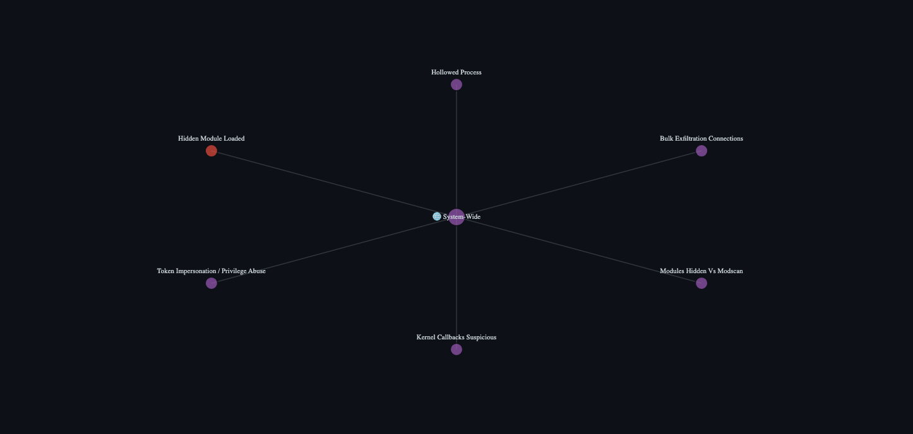
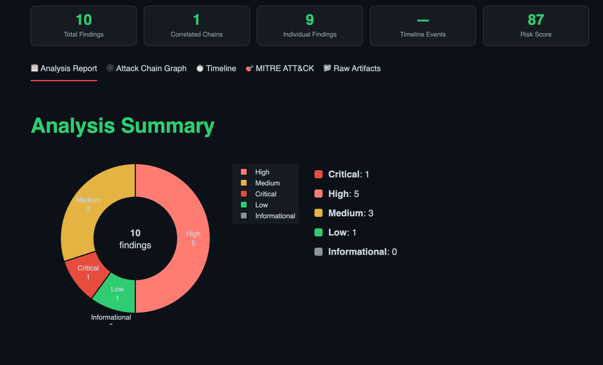

# DeepProbe
### Automated Memory Forensics with AI-Assisted Memory Forensics and Attack Chain Analysis

> **Turn a raw memory dump into a complete attack story, in minutes, not days.**

DeepProbe is an open-source memory forensics platform built on [Volatility 3](https://github.com/volatilityfoundation/volatility3). It automates the most demanding parts of incident response: running plugins, correlating findings across layers, reconstructing attack chains, and generating evidence-bound AI explanations; all through a clean browser UI.
Designed for DFIR analysts, threat hunters, and security engineers.

---

## Why DeepProbe?

Modern attackers live in memory. They inject into legitimate processes, patch kernel callbacks, disable logging, and exfiltrate data without touching disk. Catching them requires correlating dozens of Volatility outputs simultaneously;s omething that takes a skilled analyst hours and is easy to get wrong.

DeepProbe automates that correlation. It classifies every finding into forensic layers (Process, Kernel, Network, System), links them by PID and parent-child relationships, detects system-wide compromise patterns, and presents the full picture as an interactive attack chain graph. When you need a plain-English explanation, local or cloud AI is one click away with strict evidence-bound constraints so the model never hallucinates file paths or invents attack narratives.

---
## 🔍 Example Output

### Attack Chain Correlation
DeepProbe links independent findings into a single attack narrative across system layers.



### Analysis Summary
High-level view of findings, severity distribution, and risk score.



## Feature Highlights

### Detection Engine
- **70+ detection rules** across Windows, Linux, and macOS — all configurable in `detections.yaml`
- Rules cover process hiding, code injection, kernel rootkits, network C2, LOLBin abuse, credential access, persistence, defence evasion, and exfiltration
- Severity scoring with configurable bands: Informational → Low → Medium → High → Critical
- MITRE ATT&CK tags on every rule for framework alignment


### Correlation Engine — Three-Tier + System-Wide
DeepProbe's correlation engine goes well beyond PID matching:

| Tier | Method | Confidence |
|------|--------|------------|
| Strong | Same PID across findings | 🟢 Strong |
| Medium | Parent → child process relationship | 🔵 Medium |
| Weak | Behavioural co-presence across the image | 🟠 Weak |
| System-Wide | ≥2 forensic layers with high/critical findings simultaneously | 🟣 System-Wide |

The system-wide detector runs independently after all pair-based correlation — it fires when the Process, Kernel, Network, or System artifact layers each contain high-severity findings at the same time, regardless of shared PIDs.

### Modern Attack Technique Detection (8 New Engines)
| Engine | What It Detects |
|--------|----------------|
| `amsi_bypass` | AMSI patching or disablement via PowerShell / cmdline |
| `etw_patching` | ETW or Windows Event Log clearing / disablement |
| `token_impersonation` | Non-system processes holding Token handles with impersonation rights |
| `lateral_movement_ports` | Outbound connections on SMB (445), WinRM (5985/5986), RPC (135) |
| `wmi_suspicious_spawn` | WmiPrvSE.exe or MMC spawning command shells |
| `lolbin_enhanced` | Certutil, mshta, rundll32, regsvr32, msiexec used as attack proxies |
| `archive_staging` | Archives staged in Temp/Desktop/Downloads prior to exfiltration |
| `exfil_connections` | Processes with 5+ simultaneous outbound connections to external IPs |

### AI-Powered Explanations
- **Local Ollama** (Llama 3, Mistral, Phi-3 and more) — fully offline, no data leaves your machine
- **Google Gemini** — cloud option when GPU resources are unavailable
- **Auto-pull**: DeepProbe checks whether the selected model is downloaded and pulls it automatically if not
- **Evidence-bound prompts**: strict constraints prevent hallucination — no invented file paths, no fabricated PIDs, no MITRE remapping, no unsafe process-termination advice
- Dynamic narratives generated from actual findings — every explanation is specific to **this** memory image, not boilerplate

### Attack Chain Visualisation
- Interactive Plotly network graph with confidence-colour-coded centre nodes
- Purple 🌐 system-wide node for multi-layer compromise
- Per-finding hover showing process role, evidence summary, and co-presence flag
- Confidence badges (Strong / Medium / Weak / System-Wide) on every chain card

### Reporting
- **PDF report** (ReportLab) — professional dark-theme with Cover, Executive Summary, High-Severity Findings, Correlated Chains, Timeline, and All Findings Reference
- **HTML report** — standalone single-file report for sharing
- **`findings.jsonl`** — structured findings for SIEM ingestion or custom tooling
- **`correlated_findings.json`** — correlated chains exported separately for external analysis

### Additional Capabilities
- Execution timeline from Shimcache and Amcache registry hive artifacts
- MITRE ATT&CK coverage heatmap tab
- IP enrichment with AbuseIPDB (geo-location + reputation)
- Baseline deviation detection
- Summary panel with live finding counts, risk score, and timeline event count
- Cross-platform: Windows, Linux, and macOS memory dump support

---

## Getting Started

### Option 1 — Docker Compose (Recommended)

The simplest way to run DeepProbe with Ollama as a sidecar (no separate Ollama installation needed):

```bash
git clone https://github.com/purplesectools/DeepProbe.git
cd deepprobe
mkdir -p memory out
docker compose up --build
```

Then open **http://localhost:8501** in your browser.

The `docker-compose.yml` wires Ollama as a named service so DeepProbe can reach it at `http://ollama:11434`. The first time you select a model in the sidebar, DeepProbe will pull it automatically.

### Option 2 — Docker (Standalone)

If you already have Ollama running on your host:

```bash
# Build the image
docker build -t deepprobe-app .

# Create an isolated network
docker network create isolated-net

# Run the container
docker run --rm \
  --network=isolated-net \
  -p 127.0.0.1:8501:8501 \
  -v "$(pwd)/memory:/app/memory" \
  -v "$(pwd)/out:/app/out" \
  deepprobe-app
```

> **Security note:** The `-p 127.0.0.1:8501:8501` binding ensures the UI is only accessible from your local machine and not exposed on the network.

### Prerequisites

- [Docker Desktop](https://www.docker.com/products/docker-desktop/) (macOS / Windows) or Docker Engine (Linux)
- At least **8 GB RAM** available to the container for large memory images
- Ollama (optional if using docker-compose — included automatically)

---

## Using DeepProbe

1. **Place your memory image** in the `memory/` folder (e.g. `memory/workstation.raw`)
2. **Open the UI** at `http://localhost:8501`
3. **Configure analysis** in the sidebar:
   - Enter a **Project Name** and the **Memory File Name**
   - Optionally add an **AbuseIPDB API key** for IP enrichment
   - Optionally add a **Gemini API key** for cloud AI explanations
   - Select your **local Ollama model** (or let DeepProbe pull one)
4. **Click Launch Analysis**
5. **Explore the results** across five tabs:
   - 📋 **Analysis Report** — verdict, severity chart, attack story, findings narrative, detailed findings with Ask AI
   - 🕸️ **Attack Chain Graph** — interactive correlation network with confidence badges
   - ⏱️ **Timeline** — shimcache/amcache execution timeline
   - 🎯 **MITRE ATT&CK** — technique coverage mapped to findings
   - 📁 **Raw Artifacts** — full Volatility plugin output

---

## Output Files

All output is written to `out/<PROJECT_NAME>/` on your host machine:

| File | Description |
|------|-------------|
| `findings.jsonl` | All findings as newline-delimited JSON |
| `correlated_findings.json` | Correlated attack chains only |
| `report.html` | Standalone HTML report |
| `report.pdf` | Professional PDF report |
| `artifacts/` | Raw Volatility plugin CSV and text output |

---

## Configuration

### Detection Rules — `detections.yaml`

Every detection rule is defined in `detections.yaml`. Rules specify:
- `id`, `title`, `narrative` — identification and display
- `weight` — contributes to the overall risk score
- `mitre` — MITRE ATT&CK technique IDs
- `engine` — which analysis function handles this rule
- `enabled` — toggle rules on/off without deleting them
- `params` — engine-specific parameters (thresholds, patterns, allowlists)

### Baseline — `baseline.yaml`

Define your environment's expected state: trusted processes, known network ranges, allowed ports, and expected module lists. DeepProbe uses the baseline to suppress expected activity and surface genuine anomalies.

### AI Model Selection

DeepProbe ships with a curated list of recommended Ollama models:

| Model | Size | Notes |
|-------|------|-------|
| `llama3.2:3b` | ~2 GB | Fast, works on any machine |
| `llama3.1:8b` | ~5 GB | Better reasoning |
| `mistral:7b` | ~4 GB | Excellent instruction following |
| `phi3:mini` | ~2.3 GB | Lightest option |
| `gemma2:2b` | ~1.6 GB | Very lightweight |

Select your model in the sidebar. If it isn't downloaded yet, DeepProbe will pull it before running the first query.

---

## Project Structure

```
deepprobe/
├── app.py              # Streamlit UI and AI integration
├── runner.py           # Volatility wrapper, detection engines, correlation, PDF generation
├── detections.yaml     # Detection rules, scoring bands, OS profiles
├── baseline.yaml       # Environment baseline for deviation detection
├── requirements.txt    # Python dependencies
├── Dockerfile          # Container definition
├── docker-compose.yml  # DeepProbe + Ollama compose stack
├── memory/             # Place memory dump files here
└── out/                # Analysis output (auto-created)
```

---

## License

DeepProbe is a wrapper built on the [Volatility 3 Framework](https://github.com/volatilityfoundation/volatility3) and is distributed under the **Volatility Software License (VSL), Version 1.0** — a copyleft license requiring that additions and wrappers built on the Volatility Framework be made publicly available under the same terms.

A full copy of the license is available in the [`LICENSE`](./LICENSE) file.

---

## Contributing

Contributions are welcome — bug reports, new detection rules, engine improvements, and UI enhancements alike. A `CONTRIBUTING.md` with full guidelines is coming soon. In the meantime, open an issue or submit a pull request and we'll review it promptly.

---

*DeepProbe — built for analysts who need answers, not more data.*
